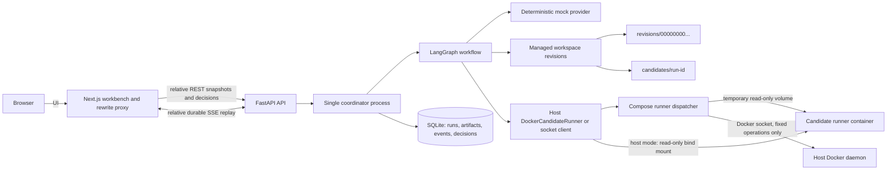
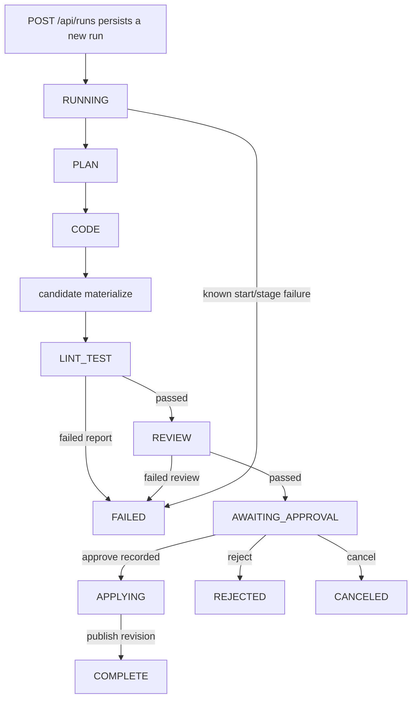

# DevFlow

[](https://github.com/CalvinL10/devflow/actions/workflows/ci.yml)

DevFlow is a local-first, human-in-the-loop code-change approval workflow. It demonstrates
durable orchestration, reconnectable event delivery, isolated candidate validation, and
recoverable publication without presenting a mock provider as a production AI agent.

**Stack:** Python 3.11 · FastAPI · LangGraph · SQLite · Next.js 16 · React 19 · Docker · Playwright

## Recruiter quick tour

- **Durable orchestration:** workflow checkpoints and domain state survive API restarts.
- **Reliable realtime UX:** REST is authoritative; persisted SSE events support replay,
  cursor recovery, ordering checks, and reconnects.
- **Safe publication model:** candidates are derived from immutable integer revisions,
  checked in constrained containers, and published with recoverable atomic rename steps.
- **Explicit engineering boundaries:** the repository distinguishes implemented evidence
  from future design work and does not claim a real LLM, multi-agent autonomy, or production HA.

Start the complete deterministic demo with `docker compose up --build --detach`, open
`http://127.0.0.1:3000`, create a run, inspect its patch and timeline, then approve or reject
it. See [Portfolio notes](docs/PORTFOLIO.md) for resume copy and an interview walkthrough,
and [Contributing](CONTRIBUTING.md) for the verification matrix.

The implemented workflow is:

`PLAN -> CODE -> candidate materialize -> LINT_TEST -> REVIEW -> AWAITING_APPROVAL -> decision -> COMPLETE/REJECTED/CANCELED`

`AWAITING_APPROVAL` is the existing persisted name for the plan's `AWAIT_APPROVAL`.
The current provider is deterministic mock code/review, not a general-purpose coding
agent. Future capabilities are listed explicitly under implemented limits below.

## Evidence map

This README deliberately separates implemented behavior from deployment limitations.
The table maps each claim to repository evidence and a command that can verify it; it does
not imply that every command has been executed in every environment.

| Claim | Repository evidence | Verification command |
| --- | --- | --- |
| Persisted single-run approval workflow | `backend/src/devflow/workflow.py`, `coordinator.py`, `database.py`; approval/restart tests | From `backend`: `uv run --locked pytest -q tests/test_approval_api.py tests/test_workflow_restart.py` |
| Durable SSE replay and reconnect contract | `backend/src/devflow/events.py`, `main.py`, `client/run-stream.mjs`; event and client tests | From `backend`: `uv run --locked pytest -q tests/test_events.py`; from `client`: `npm test` |
| Integer-revision managed workspace and publication | `backend/src/devflow/workspace.py`; workspace/publication recovery tests | From `backend`: `uv run --locked pytest -q tests/test_workspace.py tests/test_publication_recovery.py` |
| Constrained Docker candidate runner from host or Compose | `backend/src/devflow/docker_runner.py`, `runner_dispatch.py`, `candidate_runner.py`; Docker tests and CI Compose probe | `docker compose up --build --detach`, then create a run; or run the opt-in Docker test below |
| Backend-authoritative Next.js workbench | `client/app`, `client/components`, `client/lib`, Playwright acceptance | From `client`: `npm run test:e2e` |
| Locked dependency resolution | `backend/pyproject.toml`, `backend/uv.lock`, `client/package.json`, `client/package-lock.json`, both Dockerfiles | From `backend`: `uv sync --locked --python 3.11`; from `client`: `npm ci` |

The default automated suites use the deterministic mock provider. Most backend workflow
tests and all browser acceptance tests inject test runners. The opt-in Docker pipeline
test and the CI Compose smoke test execute candidate code in real containers.

## Architecture



In host mode the coordinator invokes Docker directly. In Compose, the backend has no
Docker socket or CLI; it sends fixed `lint`/`test` requests over a private Unix socket to
the dispatcher. The dispatcher copies only the selected candidate into a temporary volume,
mounts that volume read-only in a fresh constrained container, and removes it afterward.

## Workflow and persisted status flow



`PLAN`, `CODE`, `materialize`, `lint_test`, `review`, `await_approval`, and `apply` are
workflow nodes. `CREATED`, `RUNNING`, `AWAITING_APPROVAL`, `APPLYING`, `COMPLETE`,
`REJECTED`, `CANCELED`, and `FAILED` are defined run statuses, but the current creation
path inserts a new run directly as `RUNNING`; it does not persist a `CREATED` to `RUNNING`
transition. There is no revise loop: rejection is terminal, and failed checks never enter
approval.

## Fixed round-0 semantics

- One local user, one repository workspace, and at most one active run.
- One FastAPI worker with one SQLite database. Multi-worker writes are unsupported.
- Linux containers are the normative runtime; Windows is a development host only.
- Every run is pinned to an integer `base_workspace_revision`. A candidate is copied
  from `revisions/<8-digit revision>` into `candidates/<run_id>` and is never the
  published workspace. The coordinator computes this path; callers cannot select an
  arbitrary candidate directory.
- Reject resumes the graph and terminates at `REJECTED`; there is no revise loop.
- HTTP cancel is accepted only in `AWAITING_APPROVAL`. `CREATED`/`RUNNING` requests
  return HTTP 409 without recording a decision; cooperative in-flight cancellation
  is deferred. Recording approval atomically moves the run to `APPLYING`, after
  which cancel is rejected. The internal database cancellation helper is not an
  HTTP running-task cancellation implementation.
- Approve and reject both require a persisted `decision_id`. Repeating the same ID
  and payload is idempotent; reusing it with different fields is a conflict. A
  renewable database lease selects the resume owner, while an expired claim can be
  recovered after a worker exits. Renewal loss before publication can fail approval;
  once a publication record is committed it must remain recoverable, not become
  `FAILED`. Retry `/resume` or restart to finish its checkpoint/status bookkeeping.
  Publication staging cleanup and rename require a valid resume claim.
- A known start failure becomes `FAILED`. On startup, an interrupted `RUNNING` run is
  reconciled from its durable LangGraph checkpoint: an approval interrupt is restored
  to `AWAITING_APPROVAL`, while a run without a recoverable checkpoint becomes `FAILED`.
- Lint/test nodes invoke the containerized candidate runner. The
  backend workspace must never be its cwd or a mounted writable path.
- `mock` is the only provider enabled in this slice. No API key or network model call
  is used.

## Minimal HTTP contract

`POST /api/runs` accepts only `{"task":"Describe the coding task"}`. It runs this
bounded synchronous slice and returns HTTP 201 with `run_id`, `thread_id`, status,
base/patch revisions, plan, available reports, and persisted event sequence numbers.
Checks or review that reject the candidate return a persisted `FAILED` run, never an
approval interrupt. Unexpected stage exceptions fail the run and return HTTP 500.
An existing active run prevents another creation (HTTP 409). There is no background queue;
the run ID is returned after synchronous creation, then SSE can replay its events.

`POST /api/runs/{run_id}/approve`, `/reject`, and `/cancel` accept
`{"decision_id":"...","patch_revision":1,"feedback":"..."}`. The decision is
recorded transactionally and resumed from the durable checkpoint. `/resume` accepts only
`{"decision_id":"..."}` and reuses the persisted decision payload.
Decision IDs remain opaque idempotency keys (including slashes); staging paths use
the validated internal run identity instead of the external key.

`GET /api/runs/{run_id}` reads persisted artifacts and status;
`GET /api/runs/{run_id}/patch` restores the typed patch from SQLite (404 for unknown
runs, 409 before CODE has generated its patch). Request validation rejects empty or
oversized tasks and extra fields such as workspace paths, patches, or commands.

`GET /api/health` returns the typed response
`{"status":"ok","runtime":"single-instance-sqlite","provider":"mock"}` after the
application lifespan initializes SQLite. The API uses the standard library logger for
database startup, request method/path/status/duration, expected domain conflicts, and
unexpected exceptions. Query strings are not included in request logs.

Expected `DevFlowError` exceptions map to HTTP 409 responses with a stable, public
`{"error":{"code":"...","message":"..."}}` body. Unexpected exceptions are logged
server-side and return the same shape with `internal_error`; their internal details
are not sent to clients.

## SSE protocol: persistence and reconnect

`GET /api/runs/{run_id}/events` returns `text/event-stream`. It replays persisted
events and then tails the same SQLite log every 250 ms, in pages of at most 100.
There is no separate in-memory subscription or replay-to-live handoff window.
The endpoint stays open, including after terminal states, until the client disconnects.
Consumers should abort when leaving the run view. Disconnect cancellation closes the
generator; each database read closes its transaction/connection before network I/O.

```text
retry: 1000

id: 12
event: run.event
data: {"run_id":"run-example","seq":12,"type":"node.completed","node":"review","payload":{"patch_revision":1},"created_at":"..."}

: heartbeat

```

- The fixed SSE name is `run.event`; the JSON `type` is the business event type.
  JSON includes `run_id`, integer `seq`, `type`, `node`, `payload`, and `created_at`.
- `(run_id, seq)` is the existing primary key. Sequence allocation and insertion use
  the existing serialized write transaction. Committed events survive reconnect/restart;
  rolled-back inserts are not visible. Heartbeats have no ID and are not persisted.
- State transitions, generated patches and saved artifacts have an event in the same
  transaction. Artifact events contain an invalidation key, not duplicated report bodies.
- `Last-Event-ID: N` sends only events with `seq > N`. `?cursor=N` is supported for
  initial URLs; the header wins if both are supplied. Cursor values must be decimal,
  non-negative JavaScript-safe integers. Malformed values return HTTP 400
  (`invalid_cursor`), a future cursor HTTP 409 (`cursor_ahead`), and unknown runs 404.
- The serving window is the last **1,000 events per run**. With no cursor, a first
  connection starts at the beginning of that available window, not necessarily seq 1.
  Explicit `cursor=0` asks for full history and expires when that history is outside
  the window. If `N < latest_seq - 1000`, the server returns HTTP **410** with
  `error.code=cursor_expired`, `earliest_seq` and `latest_seq` before streaming begins.
  The boundary cursor `earliest_seq - 1` is valid. This is a replay serving limit,
  **not physical deletion or a disk quota**; all persisted events remain in SQLite.
- If a slow connected consumer falls outside the window, the server sends
  `event: stream.reset` with the error JSON, **without `id:`**, then closes. Fetch a
  fresh REST snapshot, mark/clear the incomplete timeline, and reconnect from that
  snapshot's `latest_seq`. Do not advance a cursor from an error or heartbeat.
- If a persisted event payload cannot be decoded, an initial replay returns HTTP 409
  with `error.code=event_store_corrupt`; an already-open stream sends an
  `event: stream.error` frame without `id:` and then closes. This is terminal for the current
  durable log, not a transient disconnect: the supplied client calls `onError` and
  rejects instead of reconnecting to the same bad row indefinitely.
- Idle connections receive `: heartbeat` approximately every 15 seconds. Responses
  set `Cache-Control: no-cache` and `X-Accel-Buffering: no`; proxy configuration still
  needs independent deployment verification.

`GET /api/runs/{run_id}` and create/decision responses now include `latest_seq`.
All snapshot fields and that watermark are read in **one SQLite read transaction**.
The existing `event_seqs` field is retained. `latest_seq` is per-run, while
`workspace_revision` has its existing independent workspace-wide meaning.

`client/run-stream.mjs` remains a dependency-free, framework-neutral consumer used
by the Next.js workbench under `client/app`. It parses chunked UTF-8 SSE, retries
EOF/network/5xx failures with bounded backoff,
resends the last applied cursor, deduplicates event callbacks by sequence, and handles
HTTP/in-stream expiry through a new snapshot. SSE invalidates state; REST remains its
authority. Snapshots older than an observed event or an accepted snapshot are ignored,
and the workspace revision cannot decrease. Use the same `RunStreamState` for other
REST responses (for example approve/reject) instead of directly replacing UI state.

```js
import { RunStreamState, watchRun } from './client/run-stream.mjs';
const stop = new AbortController();
const state = new RunStreamState(runId);
const watching = watchRun({
  runId, state, signal: stop.signal,
  onState: renderRun,
  onEvent: appendTimelineEvent,
  onReset: clearIncompleteTimeline,
  onError: renderStreamError,
  onConnection: renderConnectionState,
});
// On view disposal: stop.abort(); await watching;
// Route unrelated REST responses through state.acceptSnapshot(response) too.
```

This supplies in-memory idempotent state/timeline application, not exactly-once
external side effects. A fresh page reload bootstraps again from REST; there is no
persisted browser cursor or cross-tab coordination. The browser workbench displays
the persisted task, status, current node, workspace revision, changed files, Monaco
Diff, lint/test evidence, review findings, durable events, connection state, and
approve/reject/cancel actions. Decision success is rendered only from accepted backend
snapshots. Stable browser decision IDs are reused only while revision and feedback are
unchanged. Patch responses are checked against the current run and patch revision.

The Next rewrite proxy disables response compression because gzip buffering otherwise
prevents incremental SSE delivery. Production reverse proxies still require independent
streaming/half-open verification. There is no automatic event garbage collection,
cross-tab coordination, or multi-worker guarantee in this round.

Run the workbench locally after starting the backend on port 8000:

```powershell
npm --prefix client ci
npm --prefix client run dev
```

`DEVFLOW_API_URL` can point the Next server at another backend URL. The Playwright
harness uses a fresh isolated SQLite database/workspace and a `PassingRunner` test
double; it verifies browser state, backend snapshots, persisted database revisions,
and managed workspace contents, but it does not execute real Docker candidate commands.

Verify the client slice:

```powershell
npm --prefix client test
npm --prefix client run build
npm --prefix client run test:e2e
```

On Windows hosts where Playwright's managed `webServer` teardown waits indefinitely
after all tests finish, start `node e2e/start-backend.mjs` and the Next dev server in
separate `client` shells, then run the same suite with
`DEVFLOW_E2E_EXTERNAL_SERVERS=1`. This bypasses only Playwright's server lifecycle;
the browser still exercises the same REST/SSE endpoints and isolated runtime.

## Managed workspace, persistence ownership, and relationships

DevFlow owns these SQLite tables:

- `workspaces` is the authority for the current managed revision.
- `runs` references one workspace and stores the LangGraph `thread_id` plus the base
  revision. A partial unique index enforces one active run.
- `patches` belongs to a run and is unique by `(run_id, patch_revision)`.
- `run_artifacts` stores task, `TaskPlan`, `CheckReport`, and `ReviewReport` JSON.
  Check/review reports explicitly identify `run_id` and `patch_revision`. The check
  report contains separate lint and test `CommandResult` records, and can pass only
  if both commands pass. Approval requires successful reports for the current patch.
- `decisions` references the exact patch tuple; `decision_id` is its idempotency key.
- `decision_resume_claims` owns the renewable lease for the one caller allowed to
  resume a persisted decision.
- `run_events` belongs to a run and uses `(run_id, seq)` for per-run ordering.
- `run_checkpoint_refs` records the current `run_id -> thread_id/checkpoint_id`
  association.

LangGraph owns `checkpoints`, `checkpoint_blobs`, `checkpoint_writes`, and its
migration table. DevFlow does not duplicate or modify that library-managed schema.
The association is deliberately logical through `runs.thread_id` and is materialized
in `run_checkpoint_refs`; there is no foreign key into a dependency-owned table.

The database enables foreign keys, WAL, a busy timeout, and strict LangGraph msgpack
deserialization. SQLite is appropriate here only for the single-instance local MVP.
The production scaling direction is Postgres plus a durable Postgres checkpointer.

CODE receives text snapshots and identities, not filesystem handles, workspace
objects, runners, or write tools. `StagingFileStore` validates create/update/delete
patches in memory. Materialization reloads the exact persisted patch, checks original
contents, and applies it only to a temporary candidate. Approval rebuilds the managed
workspace revision from the persisted base revision plus persisted patch, validates the
complete tree, atomically renames the staged revision, and records publication in SQLite. Provider implementations
are trusted application code; this is a role/tool boundary, not an OS sandbox around
arbitrary Python provider plugins.

Each run reserves one patch revision, then persists its generated contents once.
This slice does not implement regeneration/revise or multiple patch revisions per run.
Fresh databases and the shipped Round-4 schema are supported. Pre-Round-4 databases
with the old cancellation CHECK constraints are rejected at startup, before application
schema/data changes, rather than failing later during HTTP cancel. There is no automatic
upgrade: back up the database **and** managed workspace, and use a separate fresh database
and workspace or wait for an explicitly reviewed migration. Do not delete historical data
or pair a fresh database with old revision directories. The Python `CANCELLED` member is
only a name alias for `CANCELED`; parsing historical `"CANCELLED"` values is not supported.
Old interrupted runs without matching check/review evidence cannot be approved; there is
no fabricated evidence migration for historical runs.

## Independent-process recovery proof

The first command starts a run and exits after LangGraph persists the interrupt:

```bash
cd backend
uv run --locked python -m devflow.workflow_cli start \
  --database ../var/devflow.sqlite \
  --run-id run-demo \
  --patch-id patch-demo
```

A separate process can reject the persisted patch on the same `thread_id`:

```bash
uv run --locked python -m devflow.workflow_cli decide \
  --database ../var/devflow.sqlite \
  --run-id run-demo \
  --patch-revision 1 \
  --decision-id decision-demo \
  --kind reject
```

Restart tests run separate subprocesses with explicitly injected test doubles. Approval
recovery uses the persisted patch and base revision, and publication is idempotently
finalized from its durable publication record. Tests cover process exits during partial
staging, after complete staging but before rename, and after rename before DB finalization.
Recovery validates and rebuilds leftover staging under a valid claim. Known-safe legacy
single-component staging names are also recovered; arbitrary external IDs are never
interpreted as legacy paths. Lease loss after committed publication is tested separately
with both retry and restart. This is evidence for these specific windows, not a claim of
complete recovery from every storage or process failure.

## Candidate runner boundary

The coordinator first materializes a candidate from the managed base revision plus
the current patch. On Linux the candidate directory is mode `0700`.

The Compose backend never receives the host Docker socket. A separate dispatcher owns it,
accepts requests only through a filesystem-protected Unix socket, validates the managed
run ID, and allows only the literal actions `lint` and `test`. It copies the exact candidate
into a per-request temporary Docker volume, so candidate containers cannot read SQLite,
published revisions, other candidates, or the Docker socket.

Build the runner, then start the local-only host API (POSIX example):

```bash
docker build --target runner -t devflow-candidate-runner backend
export DEVFLOW_DATABASE_PATH="$PWD/var/devflow.sqlite"
cd backend
uv run --locked uvicorn devflow.main:app --host 127.0.0.1 --port 8000 --workers 1
```

Only the literal actions `lint` and `test` are accepted. They resolve respectively to
`ruff check --no-cache .` and `python -I -m pytest -q -p no:cacheprovider`; no shell
is involved. The container has:

- the candidate mounted read-only at `/candidate`, with no real workspace mount;
- a read-only root filesystem and a small isolated `/tmp`;
- no network, no Linux capabilities, and `no-new-privileges`;
- a non-root UID, one CPU, 512 MiB memory, 64 PIDs, and a 60-second process timeout;
- an explicit minimal environment with the deterministic mock provider; the launcher does
  not inherit the host process environment.

This environment restriction does not prove that candidate contents or image layers contain
no sensitive data. `DockerCandidateRunner` passes only the managed candidate bind mount and
named action, never a shell command from a request or provider. It uses the non-root host UID/GID on
Linux (to retain `0700` directory access) and UID 10001 on Windows Docker Desktop. The
Docker client has a 90-second deadline and attempts to remove its own container on
timeout. Images are not implicitly pulled; `DEVFLOW_RUNNER_IMAGE` can select a trusted,
prebuilt image. Invalid command/result combinations cannot approve a run.

Windows bind mounts expose files as executable; the mock generates script headers on
Windows rather than disabling shebang lint checks. Other pre-existing candidate files
can still fail lint under these filesystem semantics. Linux remains the normative
candidate execution environment.

The runner captures exit code, stdout, stderr, duration, and timeout state. This is a
constrained local execution runner, not a proof against kernel/container escape.
This text-only slice limits files to 256 KiB, patch sets to 100 files, materialized
trees to 16 MiB/2,000 entries, and text snapshots to 1,000 files. Paths, workspace-root
ancestor links/reparse points, and original-content mismatches are rejected. There is no
global retained-run disk quota or automatic candidate garbage collection. Candidate
stdout and stderr are read incrementally into bounded 100,000-byte tails; crossing either
limit terminates the candidate process tree/group and marks the existing report fields. The
host Docker client still captures the trusted runner's bounded JSON envelope and Docker
diagnostics before parsing it.

## Dependency and lock policy

Python 3.11 is the sole normative interpreter for this slice. Direct dependencies
use bounded compatible ranges in `backend/pyproject.toml`; `backend/uv.lock` contains
the exact cross-platform resolution and is committed. Developer, CI, and Docker
commands use `uv sync --locked` or `uv run --locked`. Dependency changes must update
the project file and lock together with `uv lock --upgrade-package <name>` (or
`uv lock` for a deliberate full resolution). The lockfile is generated, never edited
by hand.

The framework-neutral SSE consumer itself has no runtime dependencies. The Next.js
workbench dependencies and exact npm resolution are recorded in `client/package.json`
and `client/package-lock.json`. Use `npm ci` for a clean install and update both files
together for deliberate frontend dependency changes.

## Clean-environment startup and verification

### Prerequisites

The repository pins its normative build/runtime tools in code and CI:

- Python **3.11** (`backend/Dockerfile` and `.github/workflows/ci.yml`);
- `uv` **0.11.6** for the container/CI path;
- Node.js **22** (`client/Dockerfile` uses 22.14.0; CI selects major 22);
- Docker with Linux containers for actual candidate execution.

Do not use `pip install` or `npm install` as substitutes for the locked commands below.
From a clean checkout, create `var/` if it does not exist.

### Local host startup: complete mock workflow

This is the local path that can execute the implemented mock workflow end to end. The
backend remains a host process because it must invoke the Docker CLI; candidate code
still runs only in the constrained runner container.

Terminal 1, from the repository root:

```bash
mkdir -p var
docker build --target runner -t devflow-candidate-runner backend
cd backend
uv sync --locked --python 3.11
DEVFLOW_DATABASE_PATH=../var/devflow.sqlite \
DEVFLOW_RUNNER_IMAGE=devflow-candidate-runner \
uv run --locked uvicorn devflow.main:app --host 127.0.0.1 --port 8000 --workers 1
```

Terminal 2, from the repository root:

```bash
npm --prefix client ci
DEVFLOW_API_URL=http://127.0.0.1:8000 npm --prefix client run dev
```

Open `http://127.0.0.1:3000`. The backend creates the managed workspace next to the
SQLite file under `var/workspaces/default`. Only one API process/worker may use this
SQLite deployment. The host user must be allowed to invoke Docker. On PowerShell, create
`var` with `New-Item -ItemType Directory -Force var` and set each environment variable with
`$env:NAME='value'` before running the corresponding command.

### Docker Compose startup: complete mock workflow

```bash
docker compose config --quiet
docker compose up --build --detach
docker compose ps
curl http://127.0.0.1:8000/api/health
# open http://127.0.0.1:3000
docker compose down --volumes
```

Both published ports bind to loopback. This starts the frontend and backend images and
persists SQLite/workspace data in `devflow-data`. The dispatcher mounts the local Docker
socket and is therefore intended only for a trusted, single-user local Docker host. A run
created through the UI or `POST /api/runs` executes real lint/test containers and reaches
`AWAITING_APPROVAL` with the deterministic mock provider. `docker compose down --volumes`
deletes the local database and managed workspace; omit `--volumes` to retain them.

### Test commands

Backend lint and full regression:

```bash
cd backend
uv sync --locked --python 3.11
uv run --locked ruff check --no-cache src tests
uv run --locked pytest -q -p no:cacheprovider tests
```

Frontend lint, unit tests, and production build:

```bash
npm --prefix client ci
npm --prefix client run lint
npm --prefix client test
npm --prefix client run build
```

Browser acceptance starts an isolated backend with a `PassingRunner` test double; it
does not prove real Docker candidate execution:

```bash
cd client
npx playwright install chromium
npm run test:e2e
```

On the documented Windows managed-server teardown issue, start
`node e2e/start-backend.mjs` and `npm run dev` in separate `client` shells, set
`DEVFLOW_E2E_EXTERNAL_SERVERS=1`, and then run `npm run test:e2e`.

Opt-in actual Docker integration test (Linux containers and the prebuilt image required):

```bash
docker build --target runner -t devflow-candidate-runner backend
cd backend
DEVFLOW_TEST_DOCKER=1 DEVFLOW_RUNNER_IMAGE=devflow-candidate-runner \
uv run --locked pytest -q -s tests/test_docker_pipeline.py
```

That opt-in test executes lint/pytest in restricted containers, checks failing and
passing candidates, associates reports with the patch revision, and verifies that the
managed published workspace is not used as the writable candidate.

## Implemented limits and unimplemented capabilities

- **SQLite / process model:** one local user, one FastAPI process, one worker, one SQLite
  database, and at most one active run. Multi-worker writes, a background queue,
  production HA, failover, and distributed exactly-once behavior are not implemented.
- **Managed workspace:** revisions are application-owned integer directories. A run is
  pinned to a base revision, candidates are disposable copies, and approval constructs
  and atomically publishes a new revision. Callers cannot submit workspace paths. This
  is not a general Git worktree manager, and same-host privileged writers remain outside
  its protection boundary.
- **Provider:** `mock` is the only provider. It deterministically creates a demonstration
  module/test pair; there is no real LLM call, arbitrary repository coding, model tool
  execution, or autonomous multi-agent collaboration.
- **Candidate runner:** only literal `lint` and `test` actions are accepted. The runner
  is constrained with read-only mounts/rootfs, no network, dropped capabilities,
  resource/time/output bounds, and a non-root user. It is not a universal security
  sandbox or proof against container/kernel escape. The Compose dispatcher is a trusted
  local component with Docker-daemon access; it is not exposed on a TCP port.
- **Workflow:** no revise/regenerate loop, no multiple patch revisions per run, and no
  cooperative cancellation while `CREATED`, `RUNNING`, or `APPLYING`.
- **Operations:** no authentication, authorization, multi-user isolation, automatic
  database migration, complete power-loss recovery, retained-run disk quota, automatic
  candidate/event garbage collection, or production reverse-proxy SSE verification.
- **Frontend:** REST snapshots remain authoritative; SSE is an invalidation/replay
  channel. There is no persisted browser cursor, cross-tab coordination, or exactly-once
  external side-effect guarantee.
- **CI evidence:** [hosted run #2](https://github.com/CalvinL10/devflow/actions/runs/35249610512)
  passed backend lint/tests, frontend lint/unit/build/Playwright, production image builds,
  and the Compose workflow smoke test on commit `447caeb`. Later revisions require their
  own successful run before making the same claim.

Do not describe this revision as a production code-review platform, a fully secure
sandbox, a real-LLM coding agent, a multi-worker/HA service, or a fully autonomous
multi-agent system.
