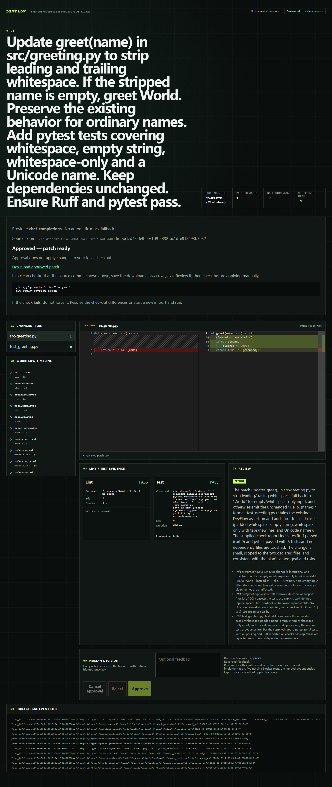

# DevFlow v0.2.0-beta.1 — validation and release record

## Scope

Local Web application distributed as source + Docker Compose. Python 3.11/pytest,
static public-PyPI wheel dependencies, one user and one active task. Real mode uses
Chat Completions; mock mode is explicitly selected for demos/tests. Approval produces
an export, not a modification to the original repository. No desktop installer,
prebuilt registry image, VS Code/Harness plugin or external account-login adapter.

See [operator instructions](BETA.md) for setup, privacy, limits and backup/restore.
The tag and GitHub Prerelease identify the published revision; the release notes link
its exact GitHub Actions run. A historical green run is not final-revision evidence.

## Measured acceptance — September 24, 2026

### Real provider and patch delivery: PASS

- Production Compose, Docker Engine 29.8.0 / Compose 5.5.1, Linux Python 3.11.
- Through the browser: HTTPS provider setup/save/connection test, source consent,
  import, task submission, durable progress, plan/code/review, isolated checks,
  human approval and approved patch download.
- Endpoint `https://api.deepseek.com`, model identifier `deepseek-flash`. This records
  the configured API identifier, not an assertion about its underlying model version.
- Synthetic source commit `1b0df46c077f01c72a0af3e5e552b78465cf5ad3`:
  a src-layout greeting function, public `colorama==0.4.6`, pytest test extra.
  Requested change: trim whitespace, use World for empty names, retain ordinary and
  Unicode names. Only source and tests changed; dependencies stayed unchanged.
- Task `run-ce679ec984e1481090ace79fe75f05aa`: Docker Ruff passed, **5 pytest cases
  passed**, real model review recommended approval, then browser approval completed.
- Export passed native `git apply --check`, apply and `git diff --check` in an
  independent Linux clone. All five exported test functions also passed under system
  Python there (not a second pytest environment). Original source remained clean.
- Live task executed on application revision `7585d004cdca6336a99f38d69a8828466448edf6`
  with the alternate-port change later committed as `59e844d`. Subsequent application
  change `106b1e7` is the database migration; the imported run was restored and checked
  again under that revision without replaying or charging for model stages.
- Provider credentials cleared after acceptance. Recovery settings report
  `key_configured:false`. No credentials are included in source, screenshots or CI.

### Recovery and migration: PASS

- Stopped the live installation, archived the data volume only, and restored to a
  separate volume/installation with fresh credentials. Database integrity passed;
  downloaded approved patch was byte-for-byte identical after restoration.
- First restoration exposed a root-owned fresh volume root despite preserved child
  ownership. Correcting only that fresh root to UID/GID 10001 fixed SQLite's readonly
  error. This requirement is now explicit in BETA.md.
- Clean startup discovered an existing pre-Round-4 demo database that the prior build
  refused. It was backed up while stopped, then migrated successfully to schema 2.
  Unit tests cover populated task/decision/checkpoint preservation, cancellation
  normalization, transactional rollback, repeated migration and newer-version refusal.
- Real imported-run backup was subsequently opened with schema 2: SQLite integrity
  `ok`, zero foreign-key errors, no credential, identical approved patch bytes.
- A Bash backup to `/mnt/f` failed the restricted-permission operation. Retrying with
  native WSL storage produced the protected complete archive. Failed backup attempts
  are not counted as successes; no original volume was deleted.

### Clean-source launchers: PASS within stated platform scope

- Clean clone at `106b1e7`: Ubuntu WSL-native source, Bash start/status/logs/stop,
  production builds, real source preview with correct modes and no errors, port 3001.
- Separate clean Windows clone at `106b1e7`: PowerShell start/status/stop, production
  demo override, port 3002. This is **demo acceptance**, not NTFS import support.
- The occupied default port was left untouched. Alternate ports update both listener
  and allowed origin; only loopback frontend is published, backend stays internal.
- Docker Desktop integration for Ubuntu was enabled with the local owner's permission.
  WSL/Docker virtual disks stayed on their existing D:/F: storage; C: is not required.
- Direct NTFS source binds exposing synthetic executable modes remain unsupported.
  No mode checks, network isolation, origin checks or secret boundaries were relaxed.

### Automated regression

- PASS — Linux Python 3.11 full backend suite excluding opt-in Docker module on
  `106b1e7`: **653 passed, 12 skipped**; one upstream Starlette/AnyIO warning.
  Used a read-only clean checkout and the production test image with network disabled.
  Skips include unavailable PowerShell and platform-specific filesystem cases.
- PASS — stable-source Windows Python 3.14.3 full backend suite excluding the
  opt-in Docker module: **652 passed, 13 skipped**, one upstream warning. This is
  additional host coverage; the supported runtime/hosted CI uses Python 3.11.
- PASS — separately enabled actual Docker pipeline module: **3 passed**, not a mock
  runner. Model output in this module is deterministic, not a paid provider test.
- PASS — launcher/Compose targeted regression: Linux **10 passed / 5 skipped**;
  Windows **8 passed / 7 skipped**. OS-specific skips are not called passes.
- PASS — backend Ruff and whitespace validation. Frontend lint/build, 26 unit tests
  and 28 browser E2E cases were already exercised locally and run again in hosted CI.
- Hosted `59e844dc23feb0f4c042d97ec24d920f369419a9`:
  [all jobs passed](https://github.com/CalvinL10/devflow/actions/runs/36048030176).
- PASS — application revision `106b1e7d6bd726d988af94a87535e2a73633001f`,
  [hosted run 36048553711](https://github.com/CalvinL10/devflow/actions/runs/36048553711):
  backend 523 unit passed / 6 skipped, 135 integration passed; frontend 26 unit and
  28 E2E passed, lint/build passed; production Docker smoke passed.
  Final publication-revision evidence belongs to the GitHub Release notes.
- The hosted production Compose smoke includes public wheel download, src-layout
  imports, read-only/offline/non-root checks, secret/socket isolation, approval/export,
  and native Git check/application. Its model output is explicitly mocked.
- Provider failure classes, stop races, async idempotency, durable SSE replay, approval
  and interrupted-publication recovery are covered by automated tests. Not every
  failure scenario has been reproduced against the paid live provider.

### Failed attempts retained for transparency

- An initial Windows full-suite attempt could not use the existing shared pytest temp
  root (permission denied). A fresh workspace-local temp root avoids that host issue.
- A retry overlapped a schema source edit and four subprocess recovery cases saw
  mismatched schema versions; the stable-source rerun above passed without waiving tests.
- Initial launcher stub execution in the Linux test helper failed on a noexec temp
  mount. The *test helper* uses an executable temporary mount; production candidate
  isolation was not changed.
- Earlier hosted attempts `35969750264` and `35970585800` failed due respectively to a
  secret-boundary test inspecting an empty directory instead of a mount, and Git fixture
  automatic maintenance racing the source comparison. Corrected tests subsequently
  passed in `35971016434` and `35971516666`; those runs do not replace final CI.

## Upgrade / rollback

Stop and back up the complete database/workspaces with the previous installation before
upgrading. Credentials are excluded; protect the archive as source/prompt data. Schema 2
supports prior unversioned demo and schema-1 beta data with ordinary transactions.
Do not downgrade the database; restore the corresponding complete backup and old image.
Normal stop keeps volumes. Do not use volume deletion/pruning as an upgrade strategy.

## Publication rules and known limits

Publish `v0.2.0-beta.1` as a **Prerelease**, only after all existing CI jobs for the tag's
commit succeed. Never overwrite an existing tag. Retain MIT and its copyright notice.
GitHub supplies the source archives; no separate binary or runtime-data asset is required.
The screenshot contains only the synthetic acceptance project, not keys or private code.

The application is not a general hostile-code sandbox or multi-user service. No arbitrary
build commands, private/VCS/path dependencies, source-distribution compilation, external
service tests, Node projects, automatic repository edits, commits or pushes. Exclusions
are not a full secret scanner; provider calls send the consented code and may cost money.
Local credential permissions are not encryption at rest. Stopping local execution does
not guarantee cancellation of remote billing. Only this bounded live use case is proven;
model quality and compatibility are not guaranteed for arbitrary projects/providers.
